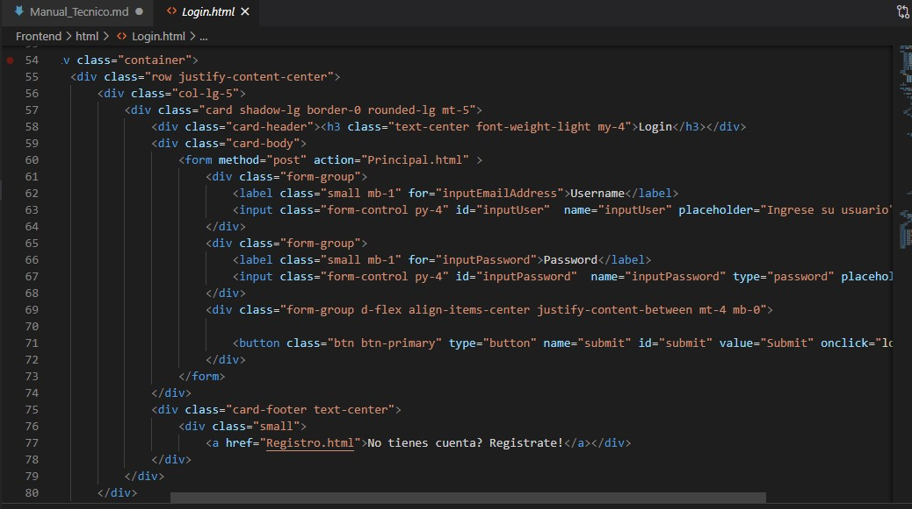
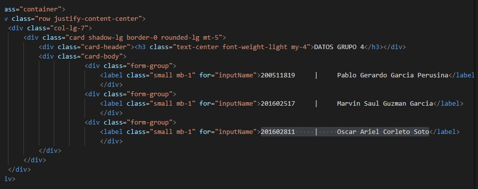
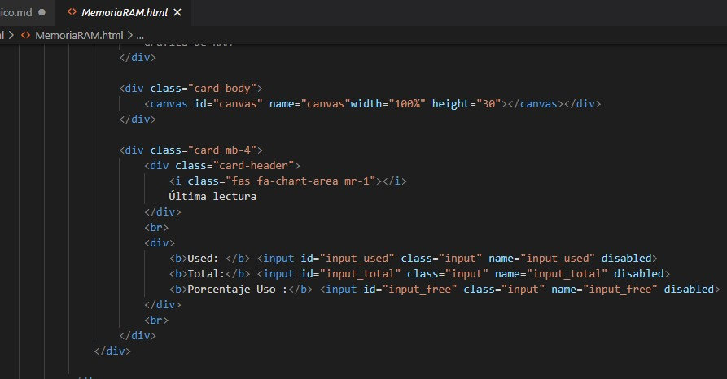
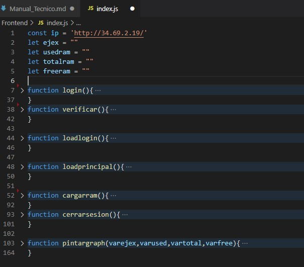
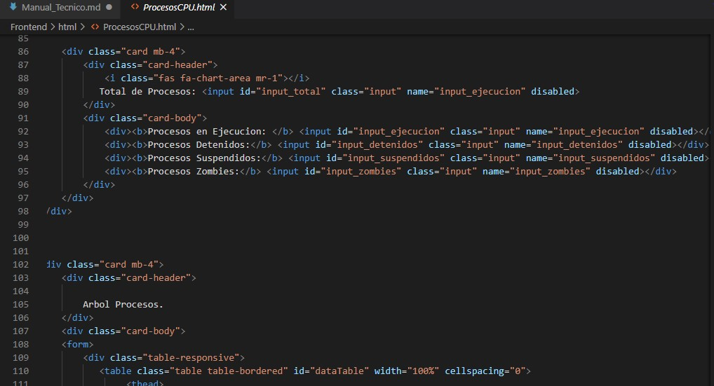
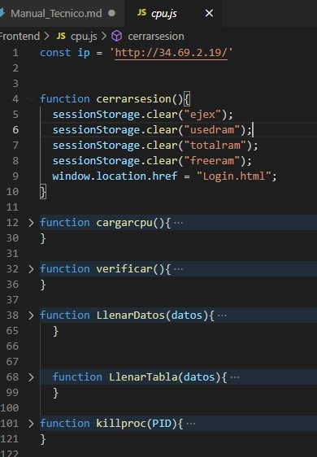
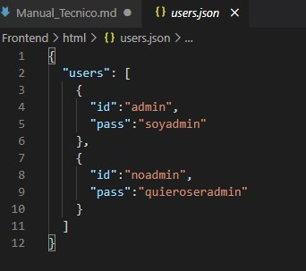
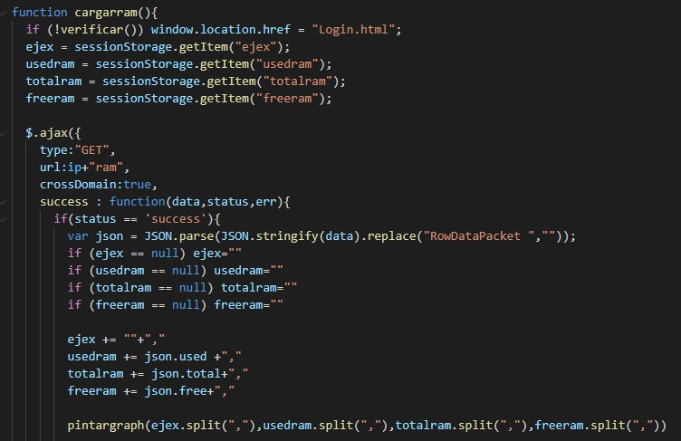
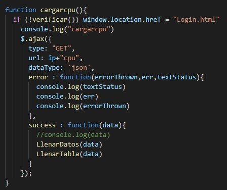
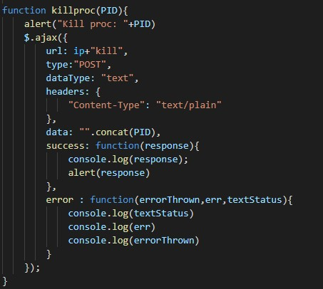

# MANUAL TECNICO PRACTICA 1
---

## Laboratorio Sistemas Operativos 2
### Vacaciones de Diciembre 2020
---

| Carnet | Nombre |
| ------ | ------ |
|200511819     |     Pablo Gerardo Garcia Perusina |
|201602517     |     Marvin Saul Guzman Garcia|
|201602811     |     Oscar Ariel Corleto Soto|

> Guatemala, 12/12/2020

---
---
## INDICE

- Introduccion

- Requerimientos Tecnicos y Herramientas

- Descripcion de la Aplicacion 

- Algoritmo 

- Desarrollo de la Configuracion
    - Frontend
    - Backend

- Logica y Funcionalidad de la aplicacion

---
---
## Introduccion

> El siguiente Manual Técnico se realizó para que el lector con conocimientos básicos de sistemas operativos y módulos de kernel, se le proporcione la lógica con la que se ha desarrollado la aplicación, También a detallar mínimas especificaciones de las funciones de cada uno de los elementos de la aplicación

---
---

## Requerimientos Tecnicos y Herramientas

> Se presentara la lista de requerimientos tecnicos que se requirien para realizar la aplicacion

-	VSCODE
    -	Tipo de programa	editor de código fuente depurador
    -	Desarrollador	Microsoft
    -	Lanzamiento	29 de abril de 2015
    -	Última versión estable 1.49.3 (info) 2 de octubre de 2020 (4 días)
    -	Programado en TypeScript, JavaScript, CSS
    -	Sistema operativo Windows 7 o posterior, macOS 10.9 o posterior, Linux
    -	Plataforma x86 y x86-64
    -	Licencia Código fuente: Licencia MIT
    -	Binarios: Freeware
    -	Estado actual	En desarrollo
    -	Idiomas múltiples idiomas

- Maquinas Virtuales Google Cloud
    -   Las máquinas de uso general E2, N1, N2 y N2D ofrecen un equilibrio entre precio y rendimiento.
    - Las máquinas optimizadas para la computación C2 proporcionan un alto rendimiento de vCPU para cargas de trabajo que requieren una gran cantidad de recursos de computación.
    - Las máquinas M2 con memoria optimizada ofrecen la mayor capacidad de memoria y son idóneas para bases de datos en memoria.
    - Las máquinas A2 optimizadas para aceleradores se basan en la GPU A100 y son idóneas para aplicaciones muy exigentes.

- Javascript
    - Es un lenguaje de programación muy conocido. Entre otras funciones, gestiona el contenido dinámico de un sitio web y permite la interacción dinámica del usuario. XML es otra variante de un lenguaje de marcado como HTML, como lo sugiere su nombre: eXtensible Markup Language. Mientras HTML está diseñado para mostrar datos, XML está diseñado para contener y transportar datos.
- AJAX
   - AJAX significa JavaScript asíncrono y XML (Asynchronous JavaScript and XML). Es un conjunto de técnicas de desarrollo web que permiten que las aplicaciones web funcionen de forma asíncrona, procesando cualquier solicitud al servidor en segundo plano

---
---

## Descripcion de la Aplicacion

> Se realizó una aplicación en la cual el usuario administrador se puede logear, la aplicacion permite visualziar la cantidad de memoria RAM usada mediante una grafica de puntos lineales, ademas de poder visualizar la cantidad de procesos en CPU simulando un arbol de procesos todo esto tomando la informacion de una maquina virtual donde estan montado los modulos de kernel especificamente para cada operacion.

---
---

## Algoritmo

> A continuacion se detallara el algoritmo de la aplicacion.

Inicio
-	Aplicación Cliente:
    - Login:
        - El administrador ingresa sus credenciales
        - ingresa a la pagina principal
    -	Pagina Principal:
        - Se muestran los datos de los desarrolladores
        - El menu tiene varias opciones
            - Memoria RAM
                - Se muestra una grafica de puntos lineales donde se puede observar la memoria total, memoria usada y la memoria disponible, asi tambien como una tabla con la ultima informacion requerida.
            - Procesos de CPU
                - Aqui se muestra la informacion de la cantidad de procesos ejecutados, detenidos, suspendidos y zombies.
                - Se muestra el arbol de procesos como una tabla , Los de color verde son procesos padre y los de color rojo los procesos hijo.
    - Cerrar Sesion
        - El usuario regresa a la pagina del login.

Fin.

---
---

## Desarrollo de la Configuracion
---
> ### Frontend

- Vistas

    Se crearon las diferentes vistas utilizando HTML y Javascript , junto con estilos de Boopstrap los cuales permitieron tener una interfaz agradable y dinamica al usuario.
    - Login 

    Codigo para crear la vista de la aplicacion.
    
    - Pagina Principal
    
    Codigo para la creacion de la vista de la pagina principal
    
    - Memoria Ram
    
    Codigo para la creacion de la vista de la memoria ram
    
    Aqui algunas funciones que se utilizaron para la creacion de la grafica y poder obtener los datos de la memoria ram
    
    - Procesos de CPU

    Codigo para la creacion de la vista de los procesos del CPU
    
    Aqui algunas funciones que se utilizaron para la creacion y rellenadod de las tablas del arbol de procesos
    
    

- Usuarios

    Para los usuarios se creo un archivo .json en el cual nos permite tener solo almacenados los usuarios verificados.
    
    

- Metodos Gets y Post

    Estos son los metodos que se utilizaron tanto para la peticion de la memoria ram, procesos del cpu y para poder crear la funcion de post para hacer KILL a un proceso

    

    

    
    

---
> ### Backend

---
---

## Logica y Funcionalidad de la aplicacion

1. El usuario administrador inica sesion
2. Es redirigido a la pagina principal donde se muestra el menu y los datos de los desarrolladores.
3. Se observa la grafica y los datos del monitoreo de la memoria RAM , este se actualiza cada 5 segundos.
4. Se puede observar tambien la tabla de arbol de procesos junto a la cantidad de los procesos actualmente con su respectivo estado. 
5. Se puede elegir hacer `KILL` a un proceso ya sea padre o hijo desde la tabla de procesos
6. Cerrar Sesion
---
---