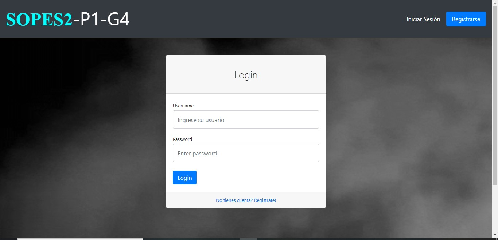
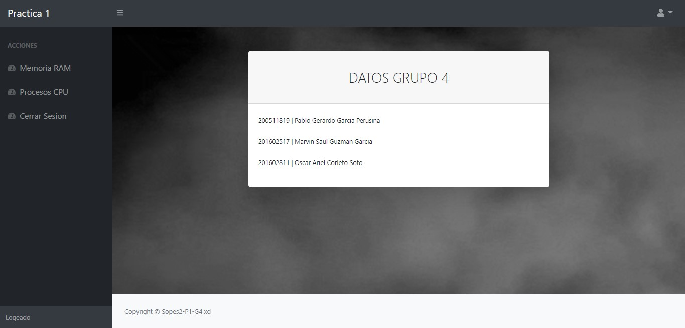
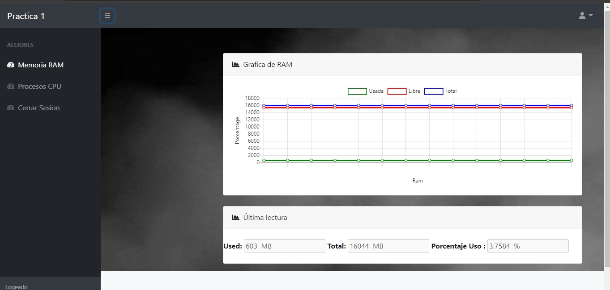
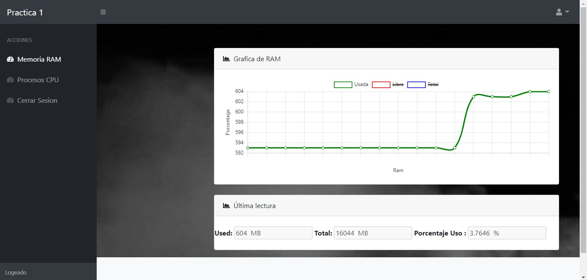
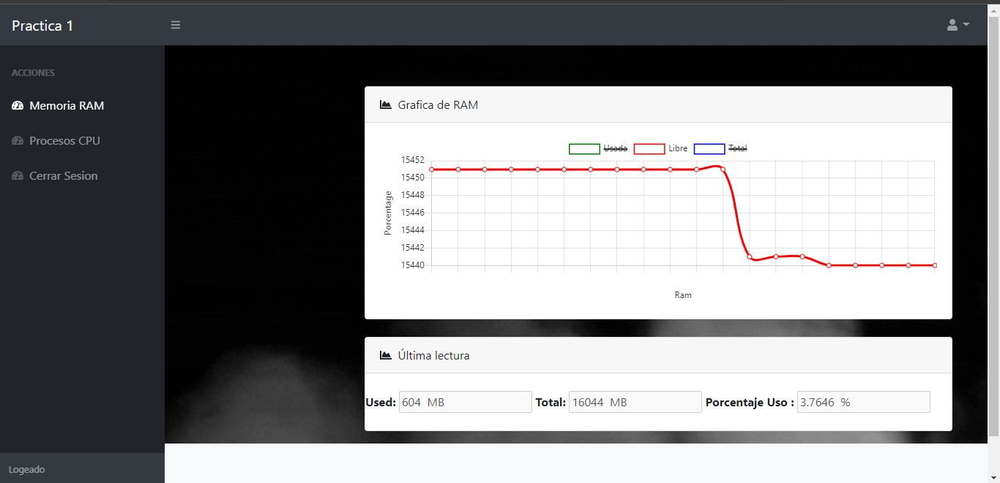
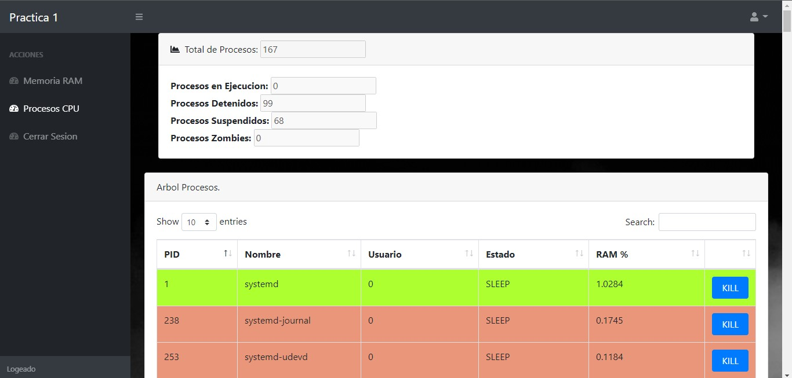
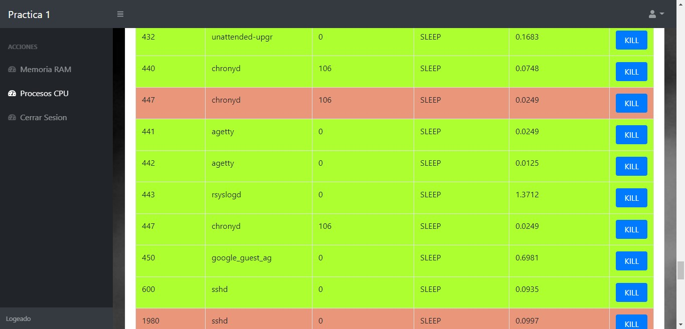
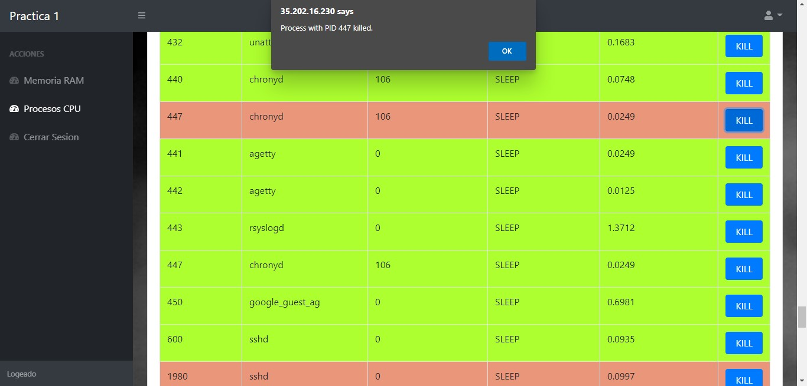
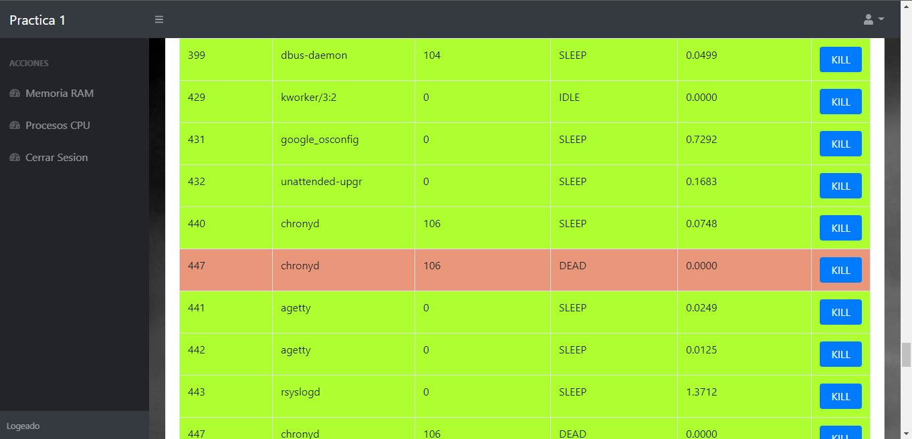

# MANUAL DE USUARIO PRACTICA 1
---

## Laboratorio Sistemas Operativos 2
### Vacaciones de Diciembre 2020
---

| Carnet | Nombre |
| ------ | ------ |
|200511819     |     Pablo Gerardo Garcia Perusina |
|201602517     |     Marvin Saul Guzman Garcia|
|201602811     |     Oscar Ariel Corleto Soto|

> Guatemala, 12/12/2020

---
---
## INDICE

- Introduccion

- Objetivos

- Requerimientos Tecnicos

- Funcionalidades y Uso del programa

---
---
## Introduccion

> El siguiente Manual de usuario se realizó para que el lector o Usuario pueda manejar y controlar todas las funciones de cada uno de los elementos de la aplicación (Monitoreo de Memoria y CPU). 

---
---
## Objetivos

- Brindar la información necesaria al usuario para entender y comprender las funciones de la aplicación.
- Representar la funcionalidad técnica de la aplicación.
- Detallar la lógica del programa y sus funciones.

---
---

## Requerimientos Tecnicos

> Para poder utilizar este programa unicamente se necesita un `Navegador web` que no tengan las politicas  `CORS`, para poder acceder a la aplicacion y hacer uso del Monitor de Memoria y CPU.

---
---

## Funcionalidades y Uso del Programa

> A continuación, se mostrará el uso y las acciones de las funciones principales del programa.

- ### Login:
    Unicamente los usuarios administradores pueden entrar a visualizar lo que es el monitor de memoria y los procesos de CPU.

    Por lo que se ingresan con las credenciales de administrador.

    

- ### Pagina Principal:
    Despues de acceder como administrador al programa este muestra la pagina principal la cual se puestran las acciones que puede visualziar asi como los datos personales de los desarrolladores.

    

- ### Monitor de Memoria RAM
    En esta seccion de la aplicacion se puede observar los datos de la memoria RAM , que viene directamente de los modulos de kernel creados en la maquina virtual.

    

    Esta informacion se actualiza cada 5 segundos , y se muestra en una grafica dinamica de puntos lineales lo que es la memoria libre, la memoria usada y la memoria total . 

    Esta grafica se puede manipular de tal forma podamos ver una unica linea.

    Memoria Usada

    

    Memoria Libre

    

- ### Procesos del CPU
    En esta seccion de la plataforma, se pueden observar lo que es la cantidad de procesos totales como tambien la cantidad de procesos por su estado:
    - Detenido
    - Suspendido
    - Zombie
    - En Ejecucion

    Tambien se puede observar una tabla la cual simula el arbol de procesos , los cuales los de color verde son los procesos padres y los posteriores de color rojo son los hijos.
    
    

- ### KILL a un proceso
    En esta seccion del programa se pueden observar la tabla de procesos, en el cual cada proceso tiene la opcion de darle kill a este mismo.

    

    Como podemos observar los procesos, daremos `KILL` al proceso hijo `#447`, se puede verificar su estado que se encuentra suspendido `SLEEP`
    

    Despues de confirmar la accion, podemos notar que el proceso hijo ahora esta muerto `DEAD`, en algunas ocaciones cuando el proceso padre no lo necesita lo elimina por completo.

    

- ### Cerrar Sesion
    Como su nombre lo indica esta accion , cierra sesion en el monitor de memoria y procesos para que otros usuarios no hagan uso de este .
---
